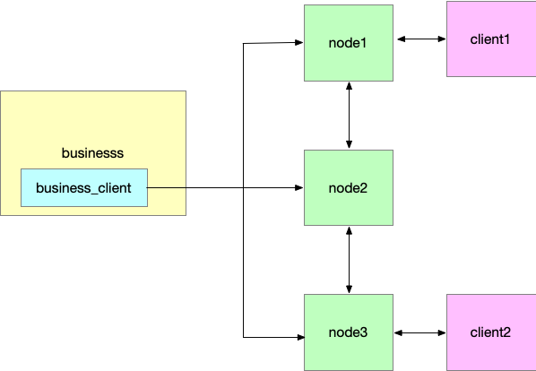

# socket-cluster

# 架构框图

- 使用business_client将业务和节点分离部署

- 后端(golang): https://github.com/weblazy/socket-cluster
- 使用demo:	

    1. 在线体验: http://web.xiaoyuantongbbs.cn:3333/login.html#/
    2. 后端源码: https://github.com/weblazy/socket-cluster-examples
    3. 前端源码: https://github.com/weblazy/socket-cluster-web

# 联系我们
- 技术支持/合作/咨询请联系作者QQ: 2276282419
- 作者邮箱: 2276282419@qq.com
- 即时通讯技术交流QQ群: 33280853