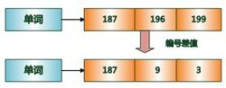

# 索引选择
#### btree
> b-tree适合大多数的数据类型，支持排序，支持大于、小于、等于、大于或等于、小于或等于的搜索。
索引与递归查询结合，还能实现快速的稀疏检索。

#### hash
> hash索引存储的是被索引字段VALUE的哈希值，只支持等值查询。Token回填等。hash索引特别适用于字段VALUE非常长的场景，例如很长的字符串，并且用户只需要等值搜索，建议使用hash index。

#### gin
> gin是倒排索引，存储被索引字段的VALUE或VALUE的元素，以及行号的list或tree。1、当需要搜索多值类型内的VALUE时，适合多值类型，例如数组、全文检索、TOKEN。2、当用户需要按任意列进行搜索时，gin支持多列展开单独建立索引域，同时支持内部多域索引的bitmapAnd, bitmapOr合并，快速的返回按任意列搜索请求的数据。

#### gist
> GiST是一个通用的索引接口。优点：Gist索引适用于多维数据类型和集合数据类型，和Btree索引类似，同样适用于其他的数据类型。和Btree索引相比，Gist多字段索引在查询条件中包含索引字段的任何子集都会使用索引扫描，而Btree索引只有查询条件包含第一个索引字段才会使用索引扫描。缺点：Gist索引创建耗时较长，占用空间也比较大。

#### sp-gist
> SP-GiST支持分区搜索树，这有助于开发各种不同的非平衡数据结构，如四叉树、kd树和基树（try）。这些结构的共同特点是它们重复地将搜索空间划分成大小不一定的分区。与分区规则匹配良好的搜索可以非常快。 1、几何类型，支持位置搜索（包含、相交、在上下左右等），按距离排序。2、范围类型，支持位置搜索（包含、相交、在左右等）。3、IP类型，支持位置搜索（包含、相交、在左右等）。

#### brin
> BRIN 索引是块级索引，有别于B-TREE等索引，BRIN记录并不是以行号为单位记录索引明细，而是记录每个数据块或者每段连续的数据块的统计信息。默认128条记录范围为一条索引，因此BRIN索引空间占用特别的小，对数据写入、更新、删除的影响也很小。BRIN属于LOSSLY索引，当被索引列的值与物理存储相关性很强时，BRIN索引的效果非常的好。例如时序数据，在时间或序列字段创建BRIN索引，进行等值、范围查询时效果很棒。 

#### rum
> rum 是一个索引插件，由Postgrespro开源，适合全文检索，属于GIN的增强版本。对全文检索的支持更加强大，不需要SORT，直接走INDEX SCAN的接口，也就是说RUM同时还实现了<=>即文本相似度的属性检索。

#### bloom
> bloom索引接口是PostgreSQL基于bloom filter构造的一个索引接口，属于lossy索引，可以收敛结果集(排除绝对不满足条件的结果，剩余的结果里再挑选满足条件的结果)，因此需要二次check，bloom支持任意列组合的等值查询。bloom存储的是签名，签名越大，耗费的空间越多，但是排除更加精准。有利有弊。可能属于的集合中去查找。 https://www.sohu.com/a/207156290_262201

#### zombodb
> 与ES结合，实现SQL接口的搜索引擎，实现数据的透明搜索。https://github.com/zombodb/zombodb?spm=a2c4e.11153940.blogcont111793.64.564b1d012gWRT6

#### bitmap
> bitmap索引，类似GIN倒排，只是bitmap的KEY是列的值，VALUE是BIT（每个BIT对应一行），而不是行号list或tree。当根据键值做and，or或 in(x,y,..)查询时，直接用索引的位图进行或运算,快速得出结果行数据。当select count(XX) 时,可以直接访问索引中一个位图就快速得出统计数据；不适合键值较多的列（重复值较少的列）；不适合update、insert、delete频繁的列，代价很高。

#### varbitx
> varbitx是阿里云RDS的扩展包，丰富bit类型的函数接口，实际上并不是索引接口，但是在PostgreSQL中使用varbitx可以代替bitmap索引，达到同样的效果。

#### 部分索引
> PostgreSQL允许用户创建部分索引，例如业务上只关心激活用户，所以可以只对激活用户创建索引。

#### 表达式索引
> 表达式索引也是PostgreSQL特有的特性，例如用户的数据需要转换后查询，例如某些设备上传的地理坐标的坐标系不符合国标，需要转换为国内的空间坐标来查询。那么可以针对这类字段，创建表达式索引，将转换过程放到表达式中，查询时也使用表达式进行查询。求手机号归属地，求奇数偶数。

