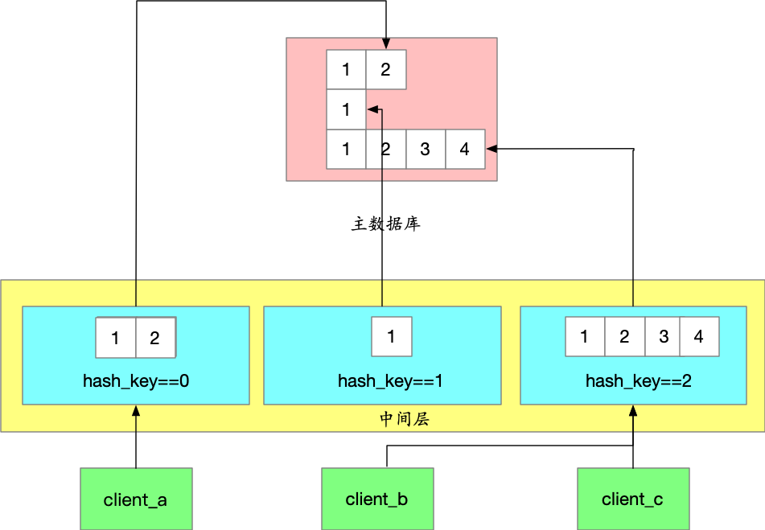

# 分布式Id生成

我们的Id生成主要分为顺序Id(mysql的自增id)和非顺序id(如:uuid),uuid如雪花算法的等方式,支持分布式,能够支持大量的客户端请求.但是由于有的业务必须要求id是有序的,如我们的消息id,必须按顺序推送给客户端.如果使用mysql自增id方式导致不能同时多个节点集群方式分配.性能较差.既要id有序性可靠递增，又要能顶住海量的访问,我们该怎么办呢.

- 预分配中间层
仔细考虑我们的需求，我们只要求递增，并没有要求连续，也就是说出现一大段跳跃是允许的（例如分配出的 id 序列：1,2,3,10,100,101）。于是我们实现了一个简单优雅的策略: 我们可以每次分配一批连续id给中间件,客户端都从中间件的内存中一个个获取id,不用每次获取id都从主数据库请求,这样的好处是我们可以批量读写Id数据库,极大提高id分配效率
- 分号段共享存储
有时候我们要求并不是所有用户之间的消息是递增的,我们只需要每个用户自己的消息id是递增即可.不同用户之间不要求有顺序关系,这就是我们说的偏序.这样我们可以按用户id做hash分配到多个id服务器,从而实现了高效的分布式,顺序id的分配.

